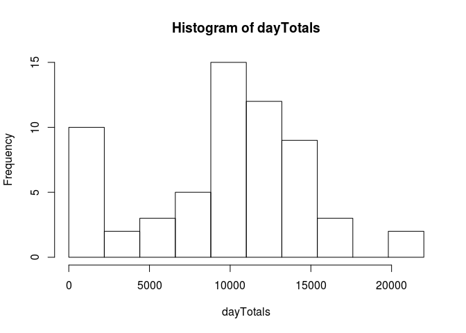

# Reproducible Research: Peer Assessment 1


## Loading and preprocessing the data

Once the file is downloaded and unzipped into your working directory, you load it into R with the "read.csv()" function:


```r
activity <- read.csv('activity.csv')
```

The "name" function shows you the names of the data frame.  To make a data frame you will use often easier to work with, use the "attach()" function so you won't have to keep typing the name out to access the columns.


```r
names(activity)
```

```
## [1] "steps"    "date"     "interval"
```

```r
attach(activity)
```
You can use "head()" to view the first few rows and get an idea of what the data frame looks like.


```r
head(activity, 10)
```

```
##    steps       date interval
## 1     NA 2012-10-01        0
## 2     NA 2012-10-01        5
## 3     NA 2012-10-01       10
## 4     NA 2012-10-01       15
## 5     NA 2012-10-01       20
## 6     NA 2012-10-01       25
## 7     NA 2012-10-01       30
## 8     NA 2012-10-01       35
## 9     NA 2012-10-01       40
## 10    NA 2012-10-01       45
```
In this case, the first few rows all have NA for the number of steps taken in that interval.  This will have to be addressed at a later time.

## What is mean total number of steps taken per day?

To find the mean total number of steps taken per day, let's first find the number of steps taken each day.  That requires adding up each of the 228 measurements for each of the 61 days.  It can be done as follows:


```r
dayTotals <- vector();#rep(0, length(date));
date <- activity$date
for(currentDate in levels(date)) {
  dayTotals <- c(dayTotals, sum(steps[date == currentDate], na.rm=TRUE));
}
hist(dayTotals, breaks=seq(0,22000,by=2200));
```

 

**To find the mean and the median, we can make use of R's appropriately named mean() and median() functions:**


```r
mean(dayTotals);
```

```
## [1] 9354.23
```

```r
median(dayTotals);
```

```
## [1] 10395
```

Of couse, we could have gotten the mean number of steps per day, 9354.23, by manually summing up the number of steps and dividing by the number of days. 

```r
sum(steps, na.rm=TRUE) / length(levels(date));
```

```
## [1] 9354.23
```


## What is the average daily activity pattern?

To find out what the "average" day looks like, lets find the average number of steps across all the days for each of the 288 intervals.  Then we can plot the number of steps per interval and see how interval 1 differs from interval 2, interval 150, etc.


```r
stepsTotals <- function(activity) {
  indices <- 1:length(steps);
  totals <- rep(0,288);
  steps <- activity$steps;
  for(i in 1:287) {
    totals[i] <- sum(steps[indices[which(indices %% 288 == i)]], na.rm=TRUE);
  }
  totals[288] <- sum(steps[indices[which(indices %% 288 == 0)]], na.rm=TRUE);
  totals;
}
totals <- stepsTotals(activity);
```
This gives us a vector of length 288, where each index contains the average number of steps for that interval.  If you want to see the actual numbers, they are:

```r
totals;
```

```
##   [1]    91    18     7     8     4   111    28    46     0    78    16
##  [12]     7    17    36     8    18     0    59    97     9     9    20
##  [23]    14     0     0     0    60     0     0     7     0    12     0
##  [34]     0    82    50     0     0     0     0    11    33    86    31
##  [45]    26     4     0     0    63    50   136     0    18    19   218
##  [56]    35   185    44   165    59     0    83   159   119   176   157
##  [67]   111   321   849   972  2091  2358  1669  2611  2850  3363  2648
##  [78]  2495  2764  2085  2333  2341  1980  2599  2322  2352  2677  2889
##  [89]  2646  2702  2951  2349  2770  3686  3066  2976  3889  3615  6860
## [100]  8349  9071  8236  9397 10927 10384  9517  9720  8852  7603  6574
## [111]  5783  5730  5497  5086  3509  2397  1314  2054  1854  1116  2150
## [122]  1430  2248  2791  2063  2692  2347  1983  1839  1502  1330  1693
## [133]  1662  1573  1130  1354  1504  1403  1772  2649  2228  2364  2440
## [144]  3137  3385  4648  5027  4917  3360  2659  2887  1718  1406  2000
## [155]  2388  3566  2244  2114  2293  2172  2451  2991  2266  1332  2118
## [166]  2838  2508  3223  2955  2754  2310  2581  1880  1990  2218  1458
## [177]   907  1382  2312  2320  1591  1912  1881  2059  2436  2531  2551
## [188]  3462  4394  5229  5412  4450  3293  3399  3951  3348  3016  3168
## [199]  2325  2044  2367  2409  2449  2315  2471  2984  2688  3245  3854
## [210]  4184  3654  3162  3980  2995  1843  1985  2156  3075  3959  4522
## [221]  3141  3592  4118  3935  4523  5271  4589  4537  4498  4125  3076
## [232]  2828  1925  1098  1452  2121  1601  1354  2420  1777  1040  1008
## [243]  1025  1767  1421  1122  1447  1131  1036  1130  1712  1068   845
## [254]   913  1243  1020   660   425   777   864   460   413   431   139
## [265]    77   195   255   451   375   461   517   117    17     6    85
## [276]   244   175   151     0    44    51    84   138   249   175    34
## [287]    12    57
```
The best way to communicate this is with a plot.

```r
plot(totals / 61, type="l")
```

 

You see how there is virtually no activity for the first quarter or so, then it rises sharply and fluctuates throughout the day, tappering off again toward the end.  This makes sense for some who goes to bed at 11pm or midnight, sleeps till 7 or so, and gets up and starts moving about.

To find the interval with the highest mean number of steps, do

```r
max(totals);
```

```
## [1] 10927
```

```r
which(totals == max(totals));
```

```
## [1] 104
```
So the interval with the highest mean number of steps is interval 104, with almost 11000.  Looking at the graph, this seems about right.

## Imputing missing values

Looking at the data, it is not hard to see that there are several days with no data for the number of steps.  It simply says "NA" instead of an actual number.  To determine how many of the steps values are NA, you can use the "is.na()" function in R and the fact that lets you use the "sum()" function on a boolean vector to determine how many elements in that vector are true.


```r
length(steps);
```

```
## [1] 17568
```

```r
sum(is.na(steps));
```

```
## [1] 2304
```

```r
sum(!is.na(steps))
```

```
## [1] 15264
```
So you can see that there are 17568 observations, of which 2304 are NA and 15264 are valid.

Up to this point, we have dealt with them by simply throwing them out.  But that may not be the best strategy since the number of steps per day and per interval could be significanly different with them in.  However, since we don't know what they are, we can't just fill them in with any value we want.  One reasonable way is simply to fill them in with the mean value for that interval.

```r
fillInNAs <- function(activity) {
  totals <- stepsTotals(activity);
  adjustedSteps <- activity$steps
  numDays <- length(as.factor(activity$days));
  for(i in 1:length(adjustedSteps)) {
    if(is.na(steps[i])) {
      if(i %% 288 == 0) {
        adjustedSteps[i] <- totals[288] / 61;
      } else {
        adjustedSteps[i] <- totals[ i %% 288] / 61;
      }
    }
  }
  adjustedSteps;
}

getAdjustedTotals <- function(activity) {
  adjustedSteps <- fillInNAs(activity);
  adjustedActivity <- data.frame(adjustedSteps, date, interval);
  names(adjustedActivity) <- names(activity);
  head(adjustedActivity);
  adjustedTotals <- stepsTotals(adjustedActivity);
  adjustedTotals;
}

adjustedTotals <- getAdjustedTotals(activity);
plot(adjustedTotals / 61, type="l")
```

 

There is little to no change in the overal shape of the adjusted graph.  It is mainly just scaled up a little.

## Are there differences in activity patterns between weekdays and weekends?

Let's see if user behavior is different on the weekend than on weekedays.

```r
isWeekend <- function(date) {
  day <- weekdays(date);
  day == "Saturday" | day == "Sunday"
}
adjustedSteps <- fillInNAs(activity);
adjustedActivity <- data.frame(adjustedSteps, date, interval);
names(adjustedActivity) <- names(activity);
weekendActivity <- adjustedActivity[isWeekend(as.Date(adjustedActivity$date)),];
weekdayActivity <- adjustedActivity[!isWeekend(as.Date(adjustedActivity$date)),];
plot(stepsTotals(weekendActivity)/61, type="l");
```

 

```r
plot(stepsTotals(weekdayActivity)/61, type="l");
```

 

So there does seem to be some differences in activity between weekends and weekdays.
